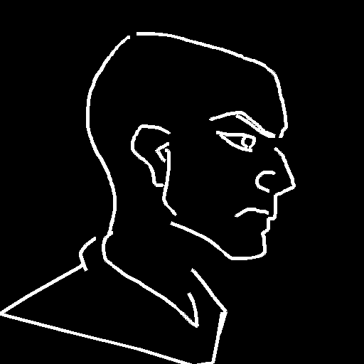
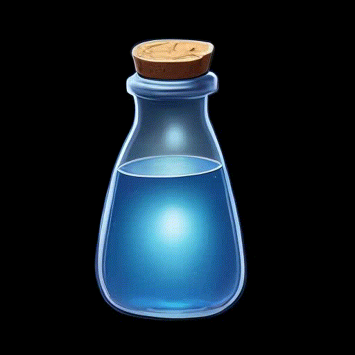
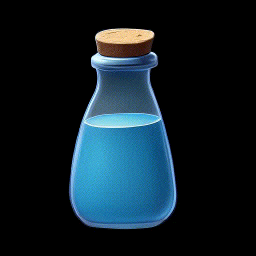
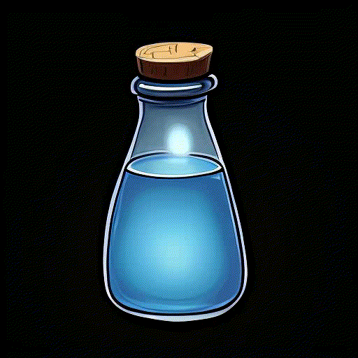
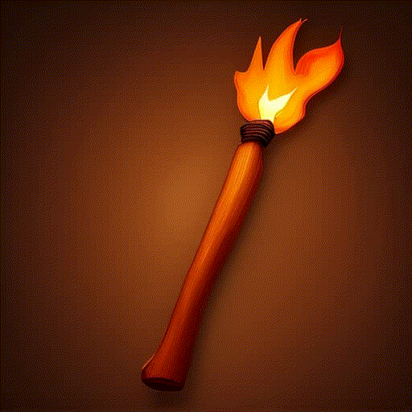
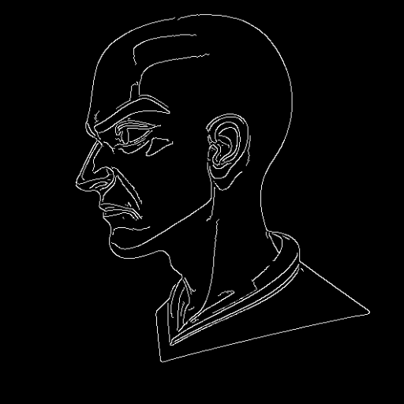
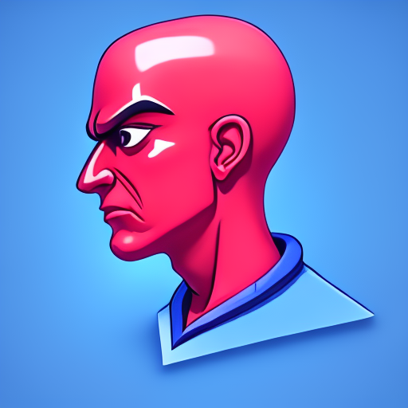
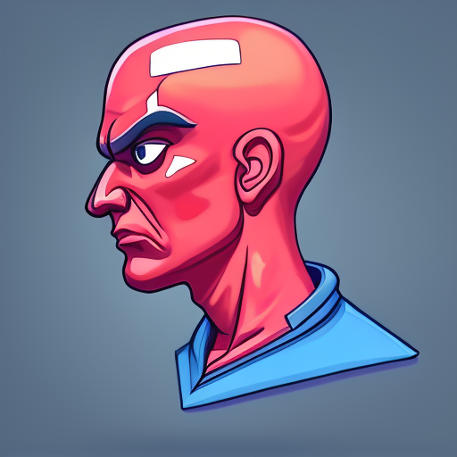

# DoodlePix
Diffusion based Drawing Assistant

https://github.com/user-attachments/assets/b6a44dc0-6d01-4285-a5ad-9f6fedf91656

This is a custom implementation of the InstructPix2Pix pipeline.

  
<strong>Click to view pipeline details</strong>

  Objective is to analyze the subtle difference between canny edges and hand-made drawings.

  
  While the first just extracts precisely the most prominent lines in an image,
  drawings are made with intention, a few squiggly lines placed in the right place can deliver a much better idea of what's being represented in the image:
  
  <table>
    <tr>
      <td style="text-align: center;">
        <strong>Drawing</strong> 
        
      </td>
      <td style="text-align: center;">
        <strong>Canny</strong> 
        
      </td>
    </tr>
  </table>
  
  To address this I train a Fidelity embedding to inject an explicit fidelity signal to the Unet that learns how to modulate its denoising behaviour accordingly.
  
  The FidelityMLP ranges from 0 to 9, (f0-f9), allowing the user to choose how much the model should "correct" their drawing.
  
  The InstructPix2Pix pipeline already supports an ImageGuidance factor, that can be passed during inference to control how much the model should follow the Image Input; 
  
  but this results only in higher values following TOO Much the drawing input, 
  while lower values completely lose composition and its nuisances.
    

## Fidelity embedding in action

-Fidelity values from 0 to 9 while keeping prompt and seed constant.
<table>
  <tr>
    <td colspan="5" style="text-align: center; font-weight: bold; padding-bottom: 8px;">
      Prompt: axe, metal, wooden handle. grey, brown wood
    </td>
  </tr>
  <tr>
    <td style="text-align: center;">
      <strong>Image</strong> 
      
    </td>
    <td style="text-align: center;">
      <strong>Normal</strong> 
      
    </td>
    <td style="text-align: center;">
      <strong>3D</strong> 
      
    </td>
    <td style="text-align: center;">
      <strong>Outline</strong> 
      
    </td>
    <td style="text-align: center;">
      <strong>Flat</strong> 
      
    </td>
  </tr>
</table>

  
<strong>More examples</strong>

<table>
  <tr>
    <td colspan="5" style="text-align: center; font-weight: bold; padding-bottom: 8px;">
      Prompt: potion, bottle, cork. blue, brown, black background.
    </td>
  </tr>
  <tr>
    <td style="text-align: center;">
      <strong>Image</strong> 
      
    </td>
    <td style="text-align: center;">
      <strong>Normal</strong> 
      
    </td>
    <td style="text-align: center;">
      <strong>3D</strong> 
      
    </td>
    <td style="text-align: center;">
      <strong>Outline</strong> 
      
    </td>
  </tr>
  <tr>
    <td colspan="4" style="text-align: center; font-weight: bold; padding-bottom: 8px;">
      Prompt: torch, flame, wood, string. brown, vibrant red
    </td>
  </tr>
  <tr>
    <td style="text-align: center;">
      <strong>Image</strong> 
      
    </td>
    <td style="text-align: center;">
      <strong>Normal</strong> 
      
    </td>
    <td style="text-align: center;">
      <strong>3D</strong> 
      
    </td>
    <td style="text-align: center;">
      <strong>Outline</strong> 
      
    </td>
  </tr>
</table>

DoodlePix shows great color fidelity, byproduct of the InstructPix2Pix architecture, especially at higher fidelity values. (WIP - implement color loss)

<table>
  <tr>
    <td colspan="8" style="text-align: center; font-weight: bold; padding-bottom: 8px;">
      Prompt: flower, stylized. *color, green, white
    </td>
  </tr>
  <tr>
    <td style="text-align: center;">
      <strong></strong> 
      
    </td>
    <td style="text-align: center;">
      <strong>red</strong> 
      
    </td>
    <td style="text-align: center;">
      <strong>light blue</strong> 
      
    </td>
    <td style="text-align: center;">
      <strong>purple</strong> 
      
    </td>
  </tr>
  <tr>
    <td style="text-align: center;">
      <strong>green</strong> 
      
    </td>
    <td style="text-align: center;">
      <strong>cyan</strong> 
      
    </td>
    <td style="text-align: center;">
      <strong>light green</strong> 
      
    </td>
    <td style="text-align: center;">
      <strong>orange</strong> 
      
    </td>
  </tr>
</table>

The model is able to achieve acceptable results within 4 steps

<table>
  <tr>
    <td colspan="5" style="text-align: center; font-weight: bold; padding-bottom: 8px;">
      Prompt: alien, shirt. vibrant red, blue
    </td>
  </tr>
  <tr>
    <td style="text-align: center;">
      <strong>Drawing Input</strong> 
      
    </td>
    <td style="text-align: center;">
      <strong>4 steps</strong> 
      
    </td>
    <td style="text-align: center;">
      <strong>50 steps</strong> 
      
    </td>
  </tr>
</table>

Moreover, I've noticed that increasing the steps above a certain threshold (30-60 steps) can increase output quality at the expense of color fidelity.

ALMMOST THERE WITH THE DATA

copy paste input edges (1) inside the Edited image folder, 
compare them briefly, use Data manager to remove or improve input edges

NEED more low values fidelity, more quick bad drawings

add black f0 values images( might be a cool idea)

Training results:
- FidelityMLP still to be implemented in the actual pipeline (was giving issues like size 78 exceeds token limits of ClipTextEncoder which is 77)
- Training with txtEncoder requiring grad kept giving errors so we split the training into two parts:
    - PreTrained txtEncoder in FP32 then load it into unet FP16 training.
- Tried training in BF16 but noticed quite some worsening in the results

Feels data needs more fidelity variation. (seemed like the image guidance was sort of working ranging from 0.5 to 5.0)- maybe FidelityMLP is not needed?

training seems to give good results in alrady 2k steps, but its a fluke, add real VALIDATION drawings, not just canny images.

learning rate should be 5e-5 dont change it.

DELETE SHITTY IMAGES, or too repetive ones.
Check "image_XXXXX, there´s a lot of repetitive ones that could be deleted or at least prompts should be matching.

TODOs

_bis for Hue and Contrast and Vibrant changes
_tris for rotatation and scale crop changes

Data

- [x] change hue of images (white bg and call them bis to correctly learn color changes of same subject)
- [x] HEX Colors NEW (dalleNew - A_outline - A_flat - edited_image - A_3D - A_painted )
- [x] Canny with various fidelity values
- [x] sort Canny after renaming (add <f=x> in front of the name. when copying the images we remove the f=x and we save it as individual txt file in another folder)
- [X] Add Doodles and change fidelity
- [X] Join Prompts
- [X] add [Shading] to Prompts
- [ ] Check all _bis

- [ ] check all normal folders for painted items, delete them all using the DataManager app
- [ ] separate normal and painted [Shading]
- [ ] resize images an save them as tris (use the ImageProcessor App)

- [ ] Halo? High low Contrast, Vibrant, Tags?
- [ ] Token Analysis
- [ ] Plot Colors in data, visualize most common tags, 
- [ ] f = fidelity, (0-9) HED f = 9, Canny f = 10, Scribble f = 3, Other Scribble f = 7
- [ ] p = shading, (flat, painted, 3D, outline)
- [ ] remove <tags:> from prompts ?

f=5, p=flat, bench, #f9c473, #cb6240, #fdfcf8, #ffffff background, <tags: gold, shield, diamond, currency, emblem>

- [ ] Dataset to train general use IpAdapter: controlnet canny + style with Flux Redux at low intensity

--REPORTS

Colors dont follow the prompt, they are random, and change a ton from seed to seed.
--Training with txtEncoder requiring grad kept giving errors
--tried training in BF16 but noticed quite some worsening in the results
--PreTrained txtEncoder in FP32 then load it into unet FP16 training.
