<h1>DoodlePix</h1>
<h3>Diffusion based Drawing Assistant</h3>

<em>Aka</em>

<em>Draw like a 5-year-old but get Great results!</em>

  <a href="assets/DoodlePixy.gif">
    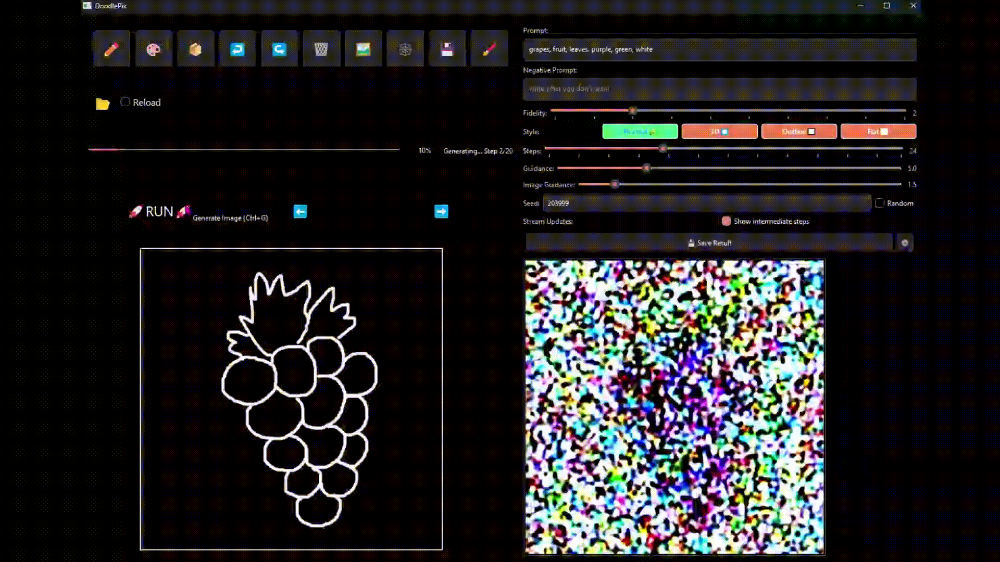
    </a>

  
<strong>Pipeline</strong>

  <ul>
    <li><strong>Inference:</strong> fits in &lt; 4GB</li> <li><strong>Resolution:</strong> 512x512px</li>
    <li><strong>Speed:</strong> ~15 steps/second</li>
  </ul>

  
<strong>Training</strong>

  <ul>
    <li><strong>Base Model:</strong> <a href="https://huggingface.co/stabilityai/stable-diffusion-2-1">StableDiffusion 2.1</a></li>
    <li><strong>Training Requirements:</strong> &lt; 14GB</li> <li><strong>Setup:</strong> NVIDIA RTX4070 </li>
  </ul>
  

    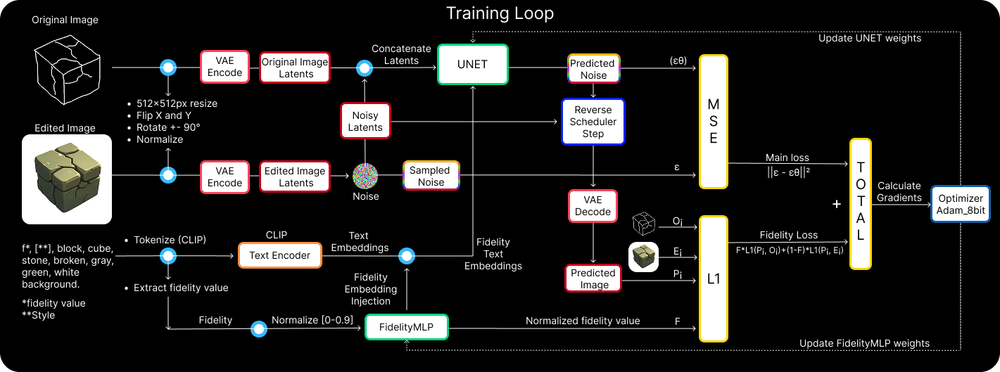
  

  

    The model is trained using the InstructPix2Pix pipeline modified with the addition of a Multilayer Perceptron (FidelityMLP). The training loop processes input_image, edited_target_image and text_prompt with embedded fidelity <code>f[0-9]</code>. Input images are encoded into the latent space (VAE encoding), The prompt is processed by a CLIP text encoder, and the extracted fidelity value ($F \in [0.0, 0.9]$) generates a corresponding fidelity embedding (through the FidelityMLP).
  

  

    The core diffusion process trains a U-Net to predict the noise ($\epsilon$) added to the VAE-encoded <em>edited target</em> latents. Then U-Net is conditioned on both the fidelity injected text embeddings (via cross-attention) and the VAE-encoded <em>input image</em> (doodles) latents.
  

  

    The optimization combines two loss terms:
  

  <ol>
    <li>A reconstruction loss ($||\epsilon - \epsilon_\theta||^2$), minimizing the MSE between the sampled noise ($\epsilon$) and the U-Net's predicted noise ($\epsilon_\theta$).</li>
    <li>A fidelity-aware L1 loss, calculated on decoded images ($P_{i}$), which balances adherence to the original input ($O_{i}$) and the edited target ($E_{i}$) based on the normalized fidelity value $F$: $F \cdot L1(P_{i}, O_{i}) + (1 - F) \cdot L1(P_{i}, E_{i})$.</li>
  </ol>
  

    The total loss drives gradient updates via an AdamW optimizer, simultaneously training the U-Net and the FidelityMLP.
  

  
<strong>Dataset</strong>

  <ul>
    <li><strong>Data Size:</strong> ~4.5k images</li>
    <li><strong>Image Generation:</strong> Dalle-3, Flux-Redux-DEV, SDXL</li>
    <li><strong>Edge Extraction:</strong> Canny, Fake Scribble, Scribble Xdog, HED soft edge, Manual</li>
    <li><strong>Doodles</strong> were hand-drawn and compose about 20% of the edges</li>
  </ul>

<h2>Fidelity Embedding in Action</h2>

<em>Fidelity values range from 0 to 9 while keeping prompt, seed, and steps constant.</em>

<table style="width:100%; table-layout: fixed;">
  <tbody>
    <tr>
      <td colspan="5" style="text-align:center; font-weight:bold; font-size:0.9rem; padding-bottom:8px;">
        Prompt: f*, red heart, white background.
      </td>
    </tr>
    <tr>
      <td style="text-align:center;">
        <strong>Image</strong> 
        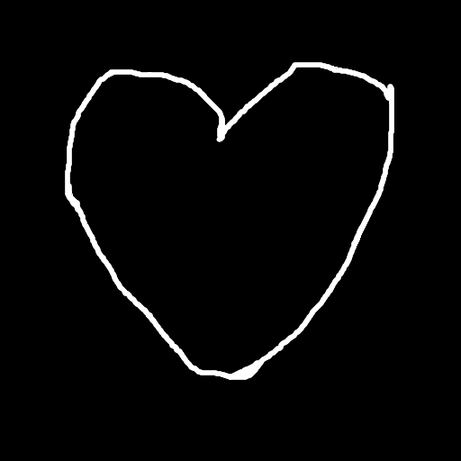
      </td>
      <td style="text-align:center;">
        <strong>Normal</strong> 
        
      </td>
      <td style="text-align:center;">
        <strong>3D</strong> 
        
      </td>
      <td style="text-align:center;">
        <strong>Outline</strong> 
        
      </td>
      <td style="text-align:center;">
        <strong>Flat</strong> 
        
      </td>
    </tr>
  </tbody>
</table>

-The model also accepts canny edges as input, while keeping fidelity injection relevant

<table style="width:100%; table-layout: fixed;">
  <tbody>
    <tr>
      <td colspan="5" style="text-align:center; font-weight:bold; font-size:0.9rem; padding-bottom:8px;">
        Prompt: f*, woman, portrait, frame. black hair, pink, black background.
      </td>
    </tr>
    <tr>
      <td style="text-align:center;">
        <strong>Image</strong> 
        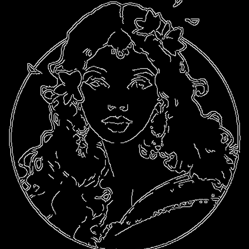
      </td>
      <td style="text-align:center;">
        <strong>Normal</strong> 
        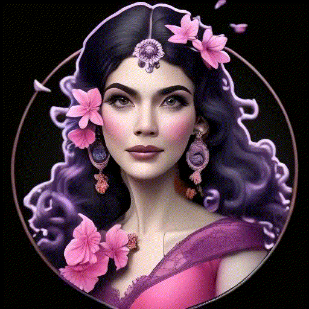
      </td>
      <td style="text-align:center;">
        <strong>3D</strong> 
        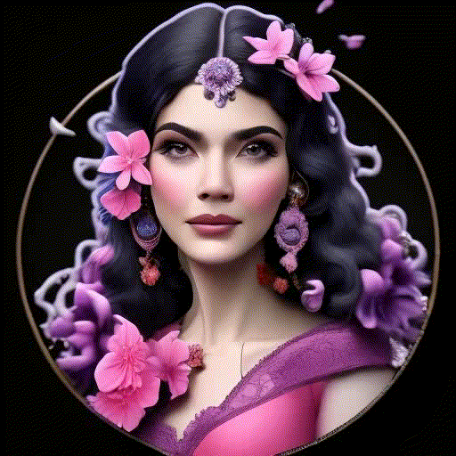
      </td>
      <td style="text-align:center;">
        <strong>Outline</strong> 
        
      </td>
      <td style="text-align:center;">
        <strong>Flat</strong> 
        
      </td>
    </tr>
  </tbody>
</table>

More Examples

<table style="width:100%; table-layout: fixed;">
  <tbody>
    <tr>
      <td colspan="2" style="text-align:center; font-weight:bold; font-size:0.9rem; padding-bottom:8px;">
        Prompt: f*, potion, bottle, cork. blue, brown, black background.
      </td>
      <td colspan="2" style="text-align:center; font-weight:bold; font-size:0.9rem; padding-bottom:8px;">
        Prompt: f*, maul, hammer. gray, brown, white background.
      </td>
      <td colspan="2" style="text-align:center; font-weight:bold; font-size:0.9rem; padding-bottom:8px;">
        Prompt: f*, torch, flame. red, brown, black background.
      </td>
    </tr>
    <tr>
      <td style="text-align:center;">
        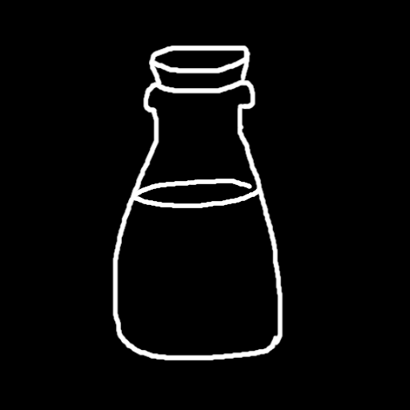
      </td>
      <td style="text-align:center;">
        
      </td>
      <td style="text-align:center;">
        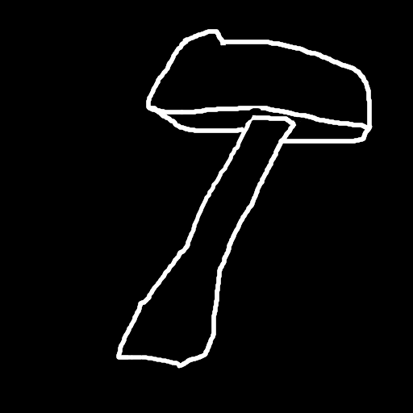
      </td>
      <td style="text-align:center;">
        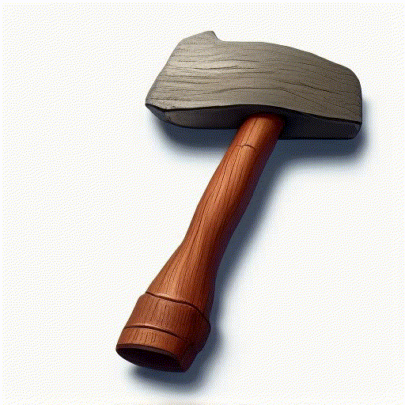
      </td>
      <td style="text-align:center;">
        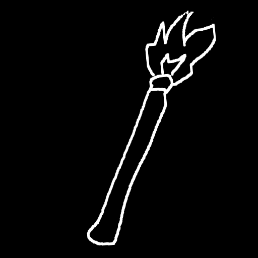
      </td>
      <td style="text-align:center;">
        
      </td>
    </tr>
  </tbody>
</table>

<table style="width:100%; height: 140px; table-layout: fixed;">
  <tbody>
    <tr>
      <td colspan="6" style="text-align:center; font-weight:italic; font-size:0.9rem; padding-bottom:0px;">
        </td>
    </tr>
    <tr>
      <td style="text-align:center;">
        input 
        
      </td>
      <td style="text-align:center;">
        F0 
        
      </td>
      <td style="text-align:center;">
        F9 
        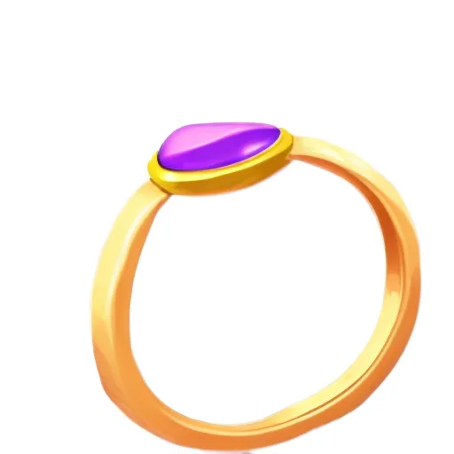
      </td>
      <td style="text-align:center;">
        input 
        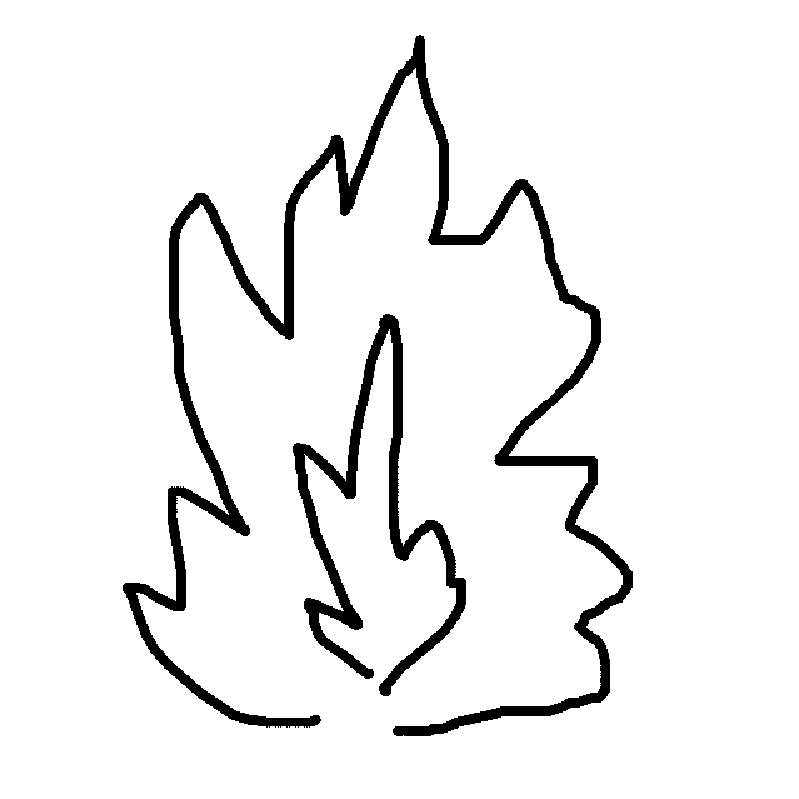
      </td>
      <td style="text-align:center;">
        F0 
        
      </td>
      <td style="text-align:center;">
        F9 
        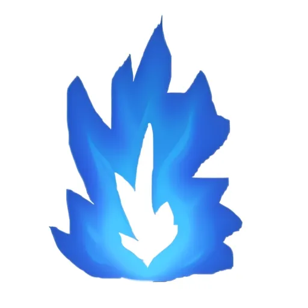
      </td>
    </tr>
  </tbody>
</table>

<h1>LORAs</h1>

Lora training allows you to quickly bake a specific Style into the model.

<table style="width:100%; height: 124px; table-layout: fixed;">
  <tbody>
    <tr>
      <td colspan="3" style="text-align:center; font-weight:italic; font-size:0.9rem; padding-bottom:0px;">
        </td>
    </tr>
    <tr>
      <td style="text-align:center;">
        input 
        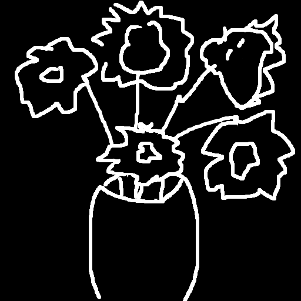
      </td>
      <td style="text-align:center;">
        Googh 
        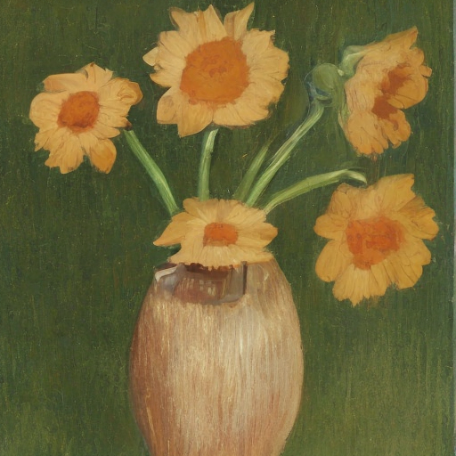
      </td>
      <td style="text-align:center;">
        DontStarve 
        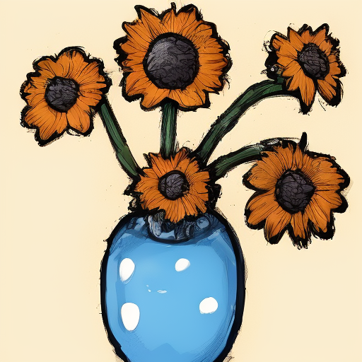
      </td>
    </tr>
    <tr>
      <td style="text-align:center;">
        input 
        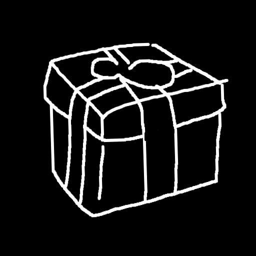
      </td>
      <td style="text-align:center;">
        Googh 
        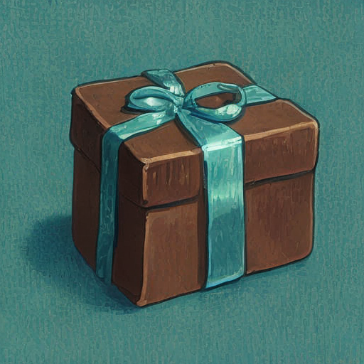
      </td>
      <td style="text-align:center;">
        DontStarve 
        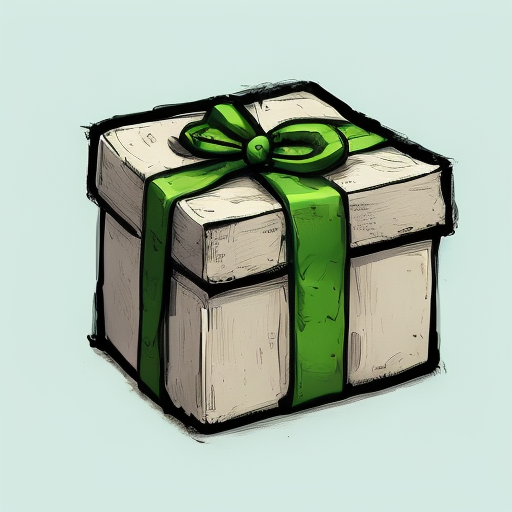
      </td>
    </tr>
  </tbody>
</table>

<h2>Lora Examples</h2>

<h2>Googh</h2>

  
Loras retains Styles and Fidelity injection from DoodlePix

  
  <table style="width:100%; height: 124px; table-layout: fixed;">
    <tbody>
      <tr>
        <td colspan="5" style="text-align:center; font-weight:italic; font-size:0.9rem; padding-bottom:0px;">
          </td>
      </tr>
      <tr>
        <td style="text-align:center;">
          input 
          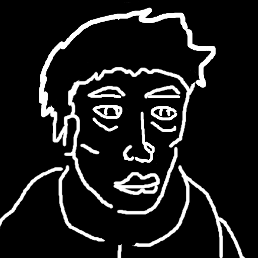
        </td>
        <td style="text-align:center;">
          Normal 
          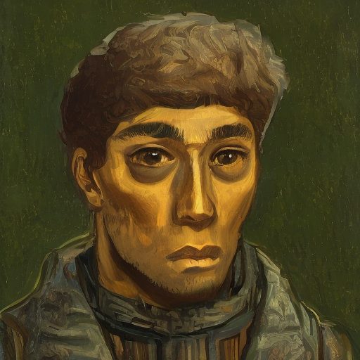
        </td>
        <td style="text-align:center;">
          3D 
          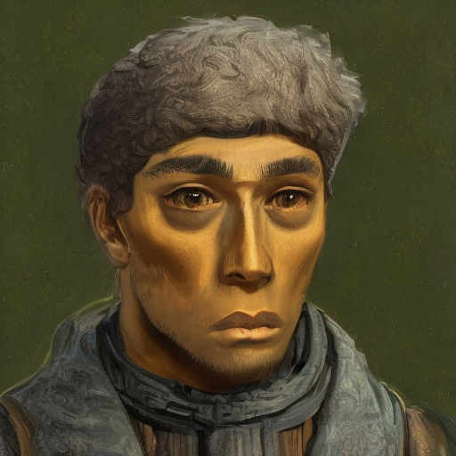
        </td>
        <td style="text-align:center;">
          Outline 
          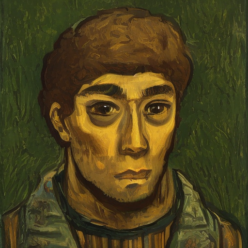
        </td>
        <td style="text-align:center;">
          Flat 
          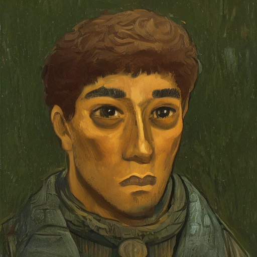
        </td>
      </tr>
      <tr>
        <td style="text-align:center;">
          Low Fidelity 
          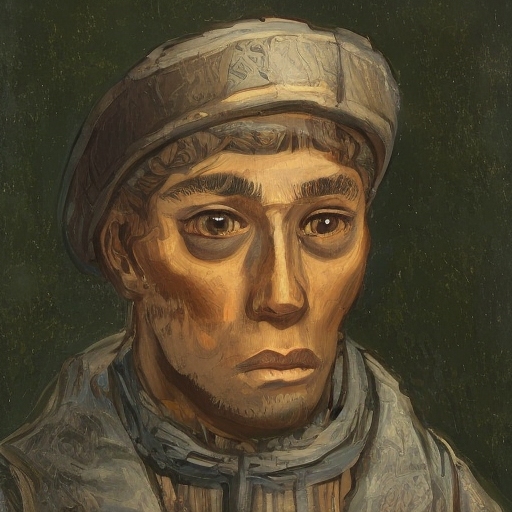
        </td>
        <td style="text-align:center;">
          High Fidelity 
          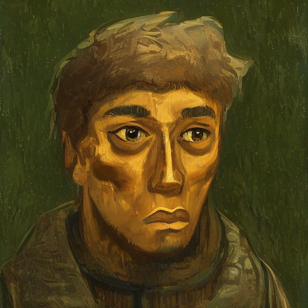
        </td>
        <td colspan="3"></td>
      </tr>
    </tbody>
  </table>

  <table style="width:100%; height: 124px; table-layout: fixed;">
    <tbody>
      <tr>
        <td colspan="5" style="text-align:center; font-weight:italic; font-size:0.9rem; padding-bottom:0px;">
          </td>
      </tr>
      <tr>
        <td style="text-align:center;">
          input 
          
        </td>
        <td style="text-align:center;">
          Normal 
          
        </td>
        <td style="text-align:center;">
          3D 
          
        </td>
        <td style="text-align:center;">
          Outline 
          
        </td>
        <td style="text-align:center;">
          Flat 
          
        </td>
      </tr>
    </tbody>
  </table>
  
  
More Examples:

  
  <table style="width:100%; height: 140px; table-layout: fixed;">
    <tbody>
      <tr>
        <td colspan="3" style="text-align:center; font-weight:italic; font-size:0.9rem; padding-bottom:0px;">
          </td>
      </tr>
      <tr>
        <td style="text-align:center;">
          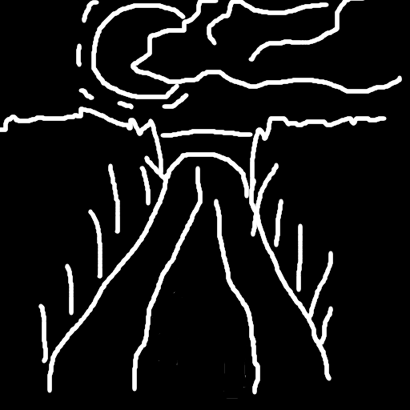
        </td>
        <td style="text-align:center;">
          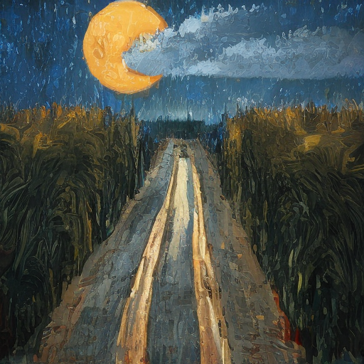
        </td>
        <td style="text-align:center;">
          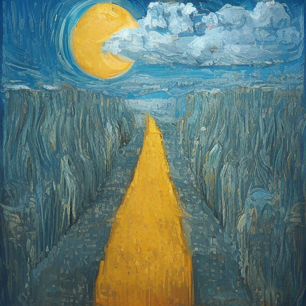
        </td>
      </tr>
      <tr>
        <td style="text-align:center;">
          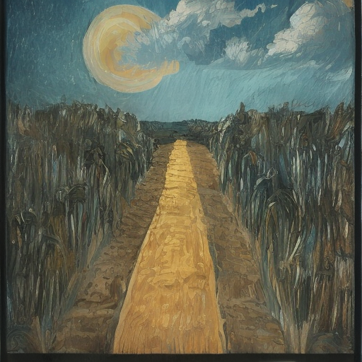
        </td>
        <td style="text-align:center;">
          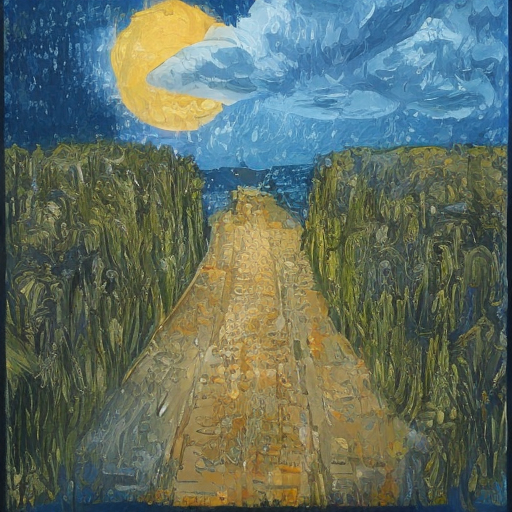
        </td>
        <td style="text-align:center;">
          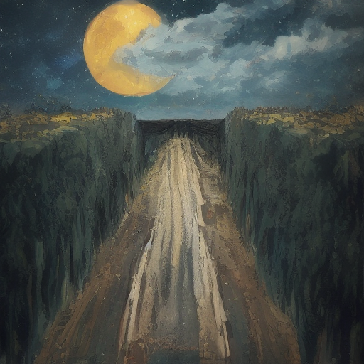
        </td>
      </tr>
    </tbody>
  </table>
  
  <table style="width:100%; height: 140px; table-layout: fixed;">
    <tbody>
      <tr>
        <td colspan="3" style="text-align:center; font-weight:italic; font-size:0.9rem; padding-bottom:0px;">
           </td>
      </tr>
      <tr>
        <td style="text-align:center;">
          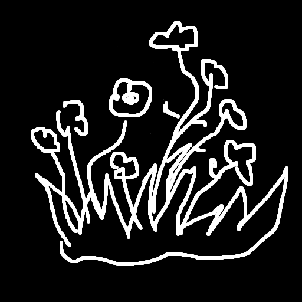
        </td>
        <td style="text-align:center;">
          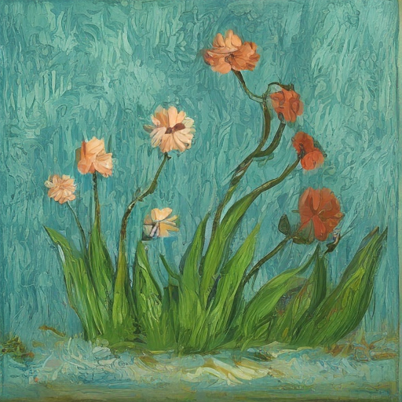
        </td>
        <td style="text-align:center;">
          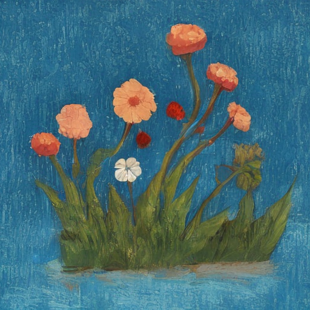
        </td>
      </tr>
      <tr>
        <td style="text-align:center;">
          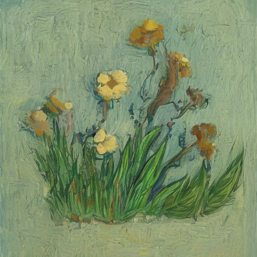
        </td>
        <td style="text-align:center;">
          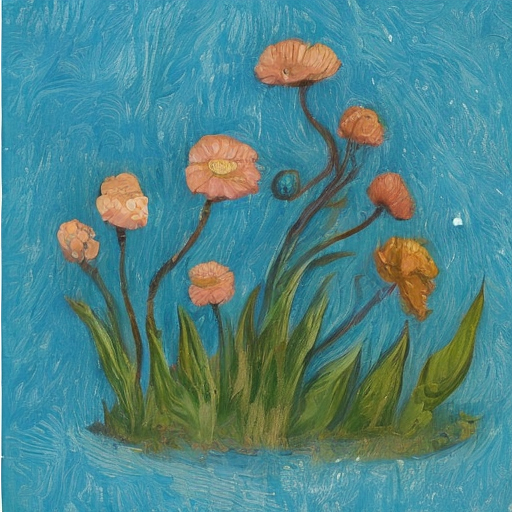
        </td>
        <td style="text-align:center;">
          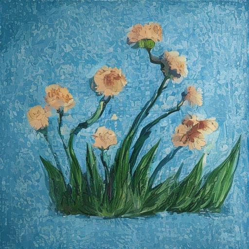
        </td>
      </tr>
    </tbody>
  </table>

  
<h2>DontStarve</h2>

  
  <table style="width:100%; height: 124px; table-layout: fixed;">
    <tbody>
      <tr>
        <td colspan="5" style="text-align:center; font-weight:italic; font-size:0.9rem; padding-bottom:0px;">
          </td>
      </tr>
      <tr>
        <td style="text-align:center;">
          Flower 
          
        </td>
        <td style="text-align:center;">
           
          
        </td>
        <td style="text-align:center;">
           
          
        </td>
        <td style="text-align:center;">
           
          
        </td>
        <td style="text-align:center;">
           
          
        </td>
      </tr>
      <tr>
        <td style="text-align:center;">
          Gift 
          
        </td>
        <td style="text-align:center;">
           
          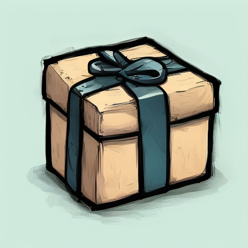
        </td>
        <td style="text-align:center;">
           
          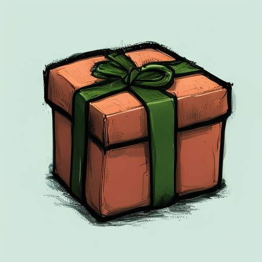
        </td>
        <td style="text-align:center;">
           
          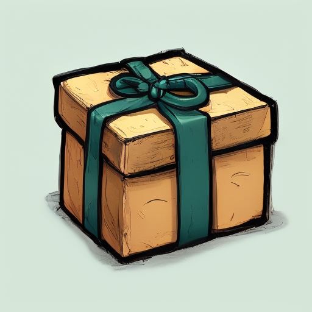
        </td>
        <td style="text-align:center;">
           
          
        </td>
       </tr> <tr>
        <td style="text-align:center;">
          Carrot 
          
        </td>
        <td style="text-align:center;">
           
          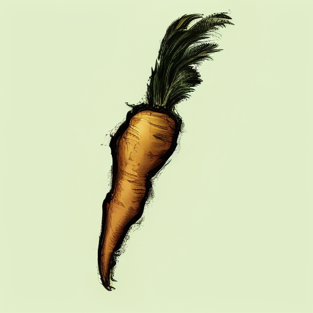
        </td>
        <td style="text-align:center;">
           
          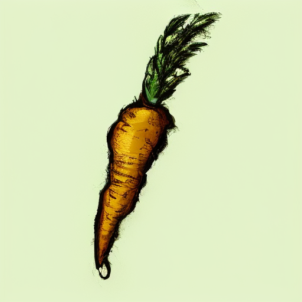
        </td>
        <td style="text-align:center;">
           
          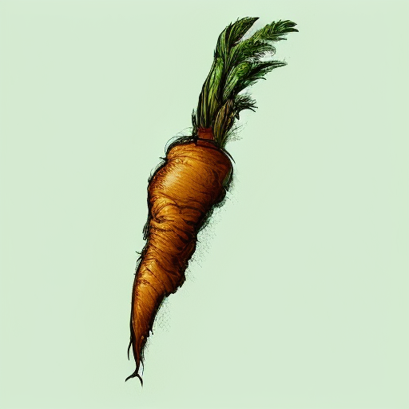
        </td>
        <td style="text-align:center;">
           
          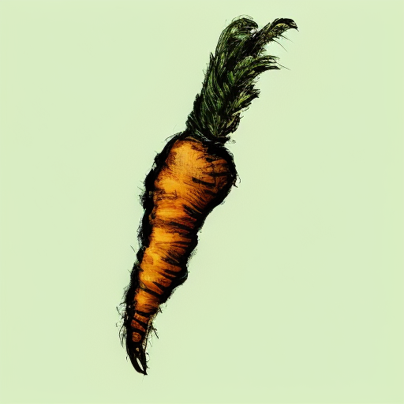
        </td>
      </tr>
      <tr>
        <td style="text-align:center;">
          Rope 
          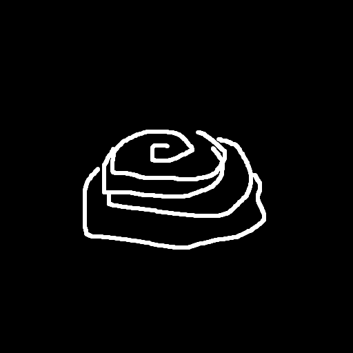
        </td>
        <td style="text-align:center;">
           
          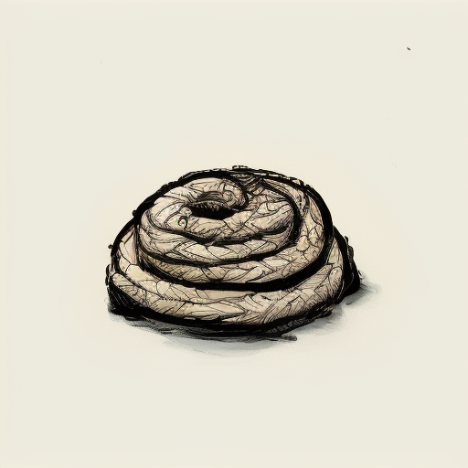
        </td>
        <td style="text-align:center;">
           
          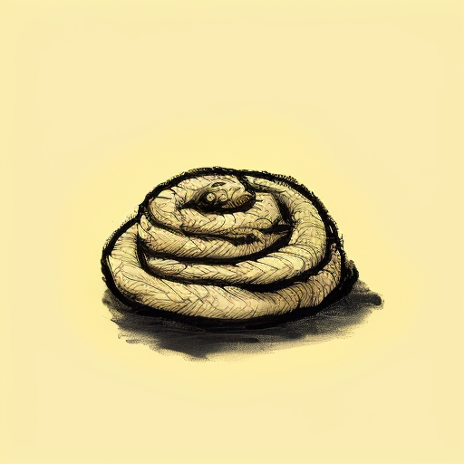
        </td>
        <td style="text-align:center;">
           
          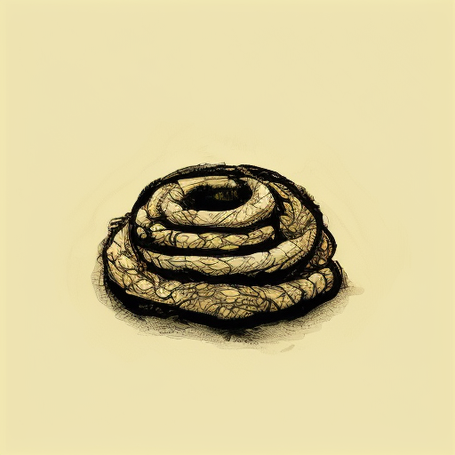
        </td>
        <td style="text-align:center;">
           
          
        </td>
      </tr>
      <tr>
        <td style="text-align:center;">
          Potato 
          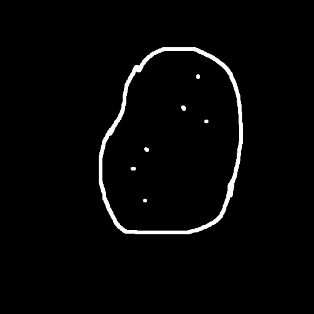
        </td>
        <td style="text-align:center;">
           
          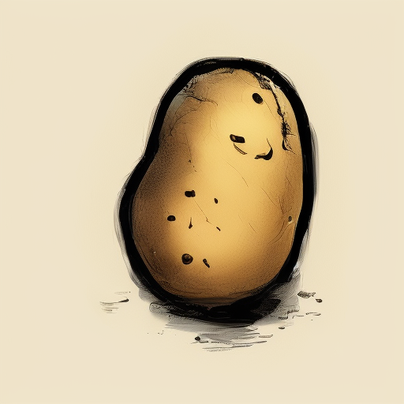
        </td>
        <td style="text-align:center;">
           
          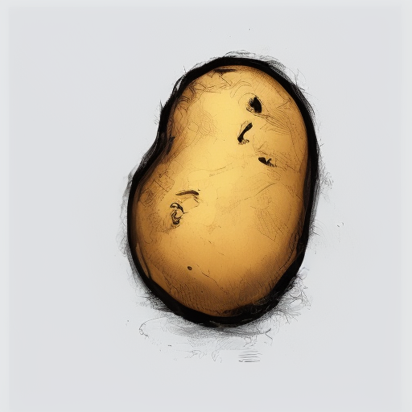
        </td>
        <td style="text-align:center;">
           
          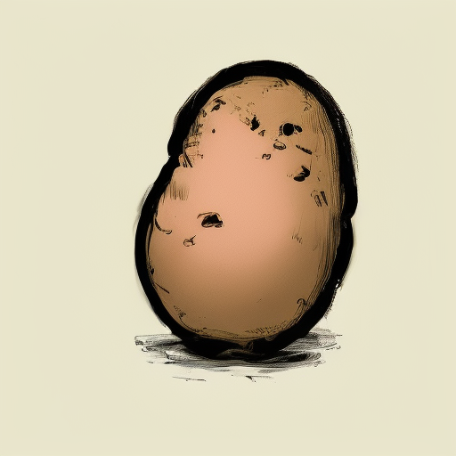
        </td>
        <td style="text-align:center;">
           
          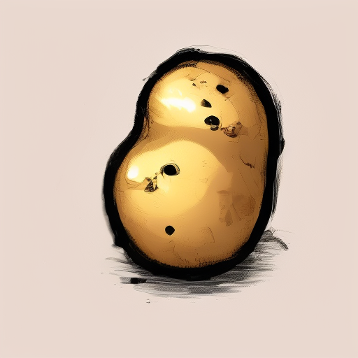
        </td>
      </tr>
      <tr>
        <td style="text-align:center;">
          Heart 
          
        </td>
        <td style="text-align:center;">
           
          
        </td>
        <td style="text-align:center;">
           
          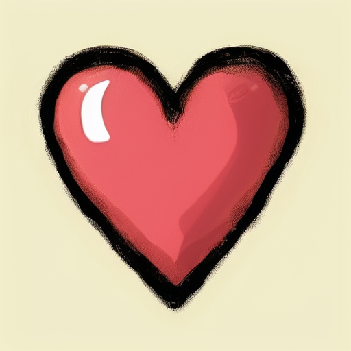
        </td>
        <td style="text-align:center;">
           
          
        </td>
        <td style="text-align:center;">
           
          
        </td>
      </tr>
      <tr>
        <td style="text-align:center;">
          Axe 
          
        </td>
        <td style="text-align:center;">
           
          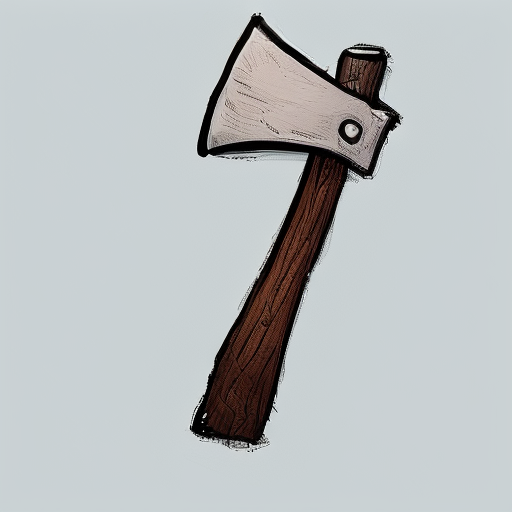
        </td>
        <td style="text-align:center;">
           
          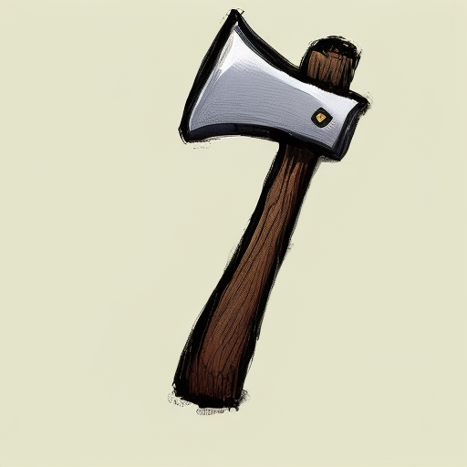
        </td>
        <td style="text-align:center;">
           
          
        </td>
        <td style="text-align:center;">
           
          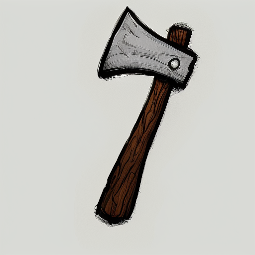
        </td>
      </tr>
      <tr>
        <td style="text-align:center;">
          Potion 
          
        </td>
        <td style="text-align:center;">
           
          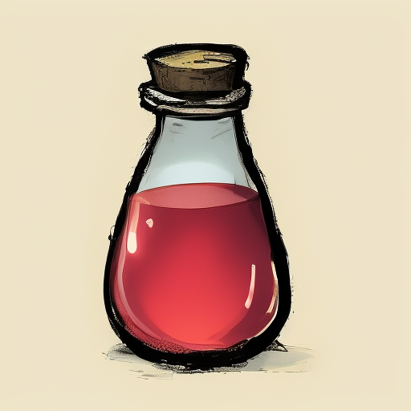
        </td>
        <td style="text-align:center;">
           
          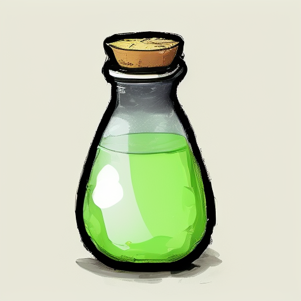
        </td>
        <td style="text-align:center;">
           
          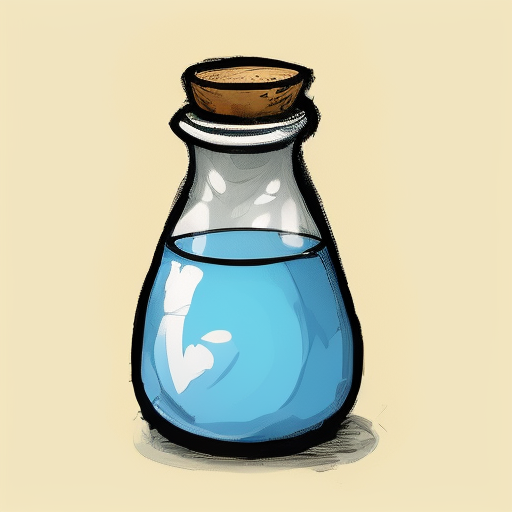
        </td>
        <td style="text-align:center;">
           
          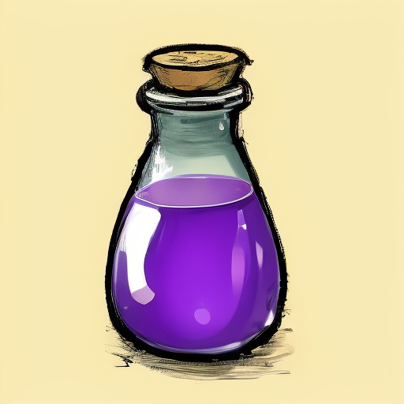
        </td>
      </tr>
      <tr>
        <td style="text-align:center;">
          Torch 
          
        </td>
        <td style="text-align:center;">
           
          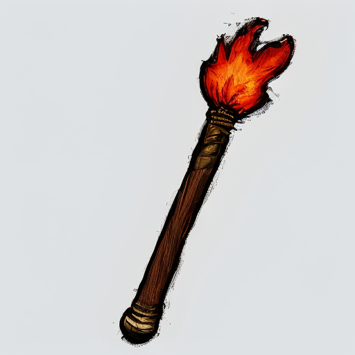
        </td>
        <td style="text-align:center;">
           
          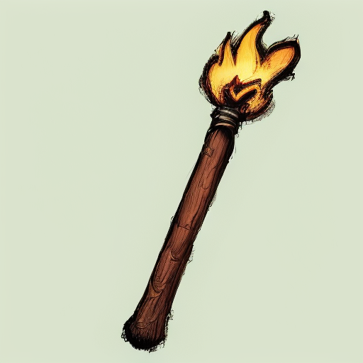
        </td>
        <td style="text-align:center;">
           
          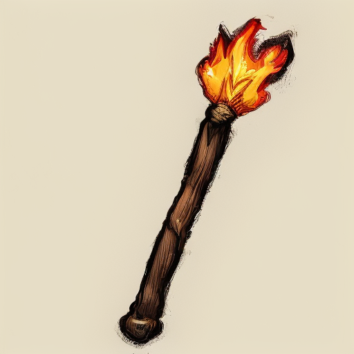
        </td>
        <td style="text-align:center;">
           
          
        </td>
      </tr>
    </tbody>
  </table>

The model shows great color understanding.

<table style="width:100%; height: 164px; table-layout: fixed;">
  <tbody>
    <tr>
      <td colspan="4" style="text-align:center; font-weight:bold; font-size:0.9rem; padding-bottom:8px;"> Prompt: f9, flower, stylized. *color, green, white
      </td>
    </tr>
    <tr>
      <td style="text-align:center;">
        <strong>input</strong> 
        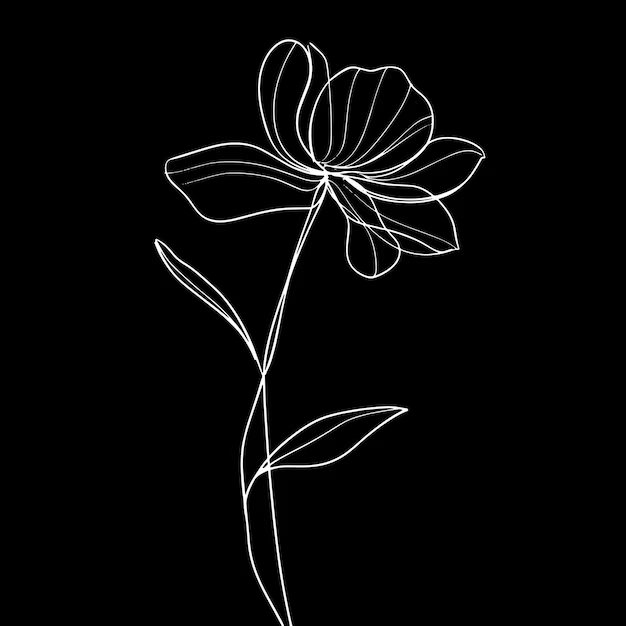
      </td>
      <td style="text-align:center;">
        <strong>red</strong> 
        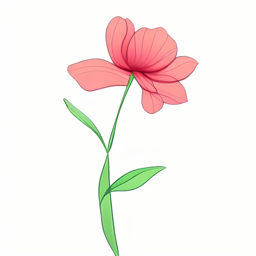
      </td>
      <td style="text-align:center;">
        <strong>blue</strong> 
        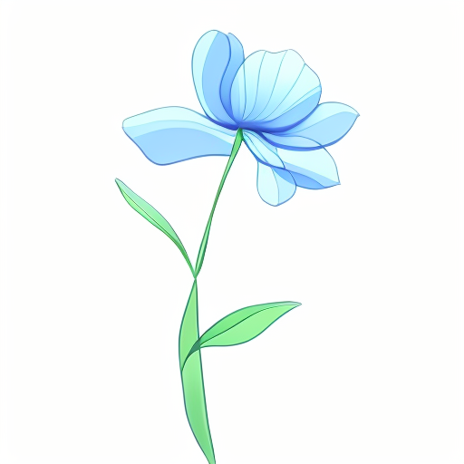
      </td>
      <td style="text-align:center;">
        <strong>purple</strong> 
        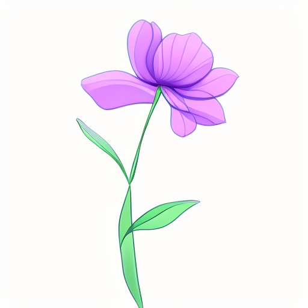
      </td>
    </tr>
    <tr>
      <td style="text-align:center;">
        <strong>green</strong> 
        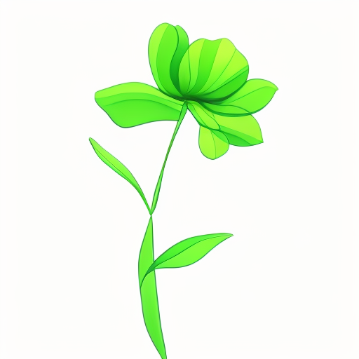
      </td>
      <td style="text-align:center;">
        <strong>cyan</strong> 
        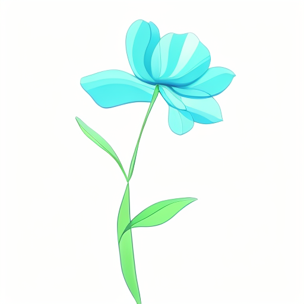
      </td>
      <td style="text-align:center;">
        <strong>yellow</strong> 
        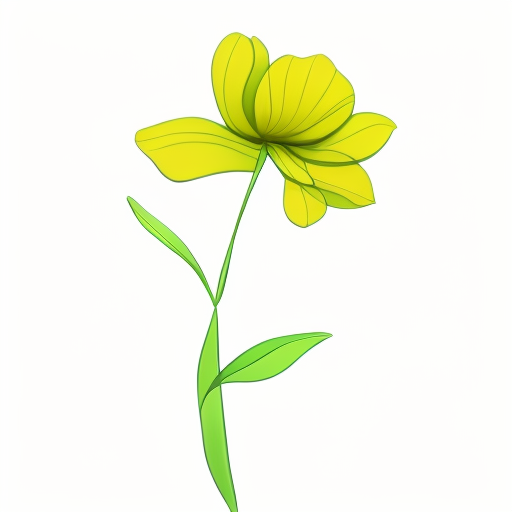
      </td>
      <td style="text-align:center;">
        <strong>orange</strong> 
        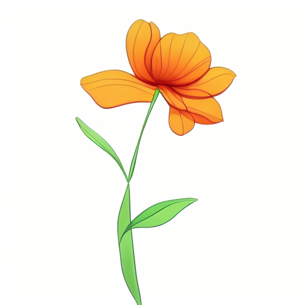
      </td>
    </tr>
  </tbody>
</table>

  
<strong>Limitations</strong>

  <ul>
    <li>The <strong>Model</strong> was trained mainly on objects, items. Things rather than Characters.</li>
    <li>It inherits most of the limitations of the StableDiffusion 2.1 model.</li>
  </ul>

  
<strong>Reasoning</strong>

  

    The objective is to train a model able to take drawings as inputs.
  

  

    While most models and controlnets were trained using canny or similar line extractors as inputs (which focuses on the most prominent lines in an image),
  drawings are made with intention. A few squiggly lines placed in the right place can sometimes deliver a much better idea of what's being represented in the image:
  

  <table style="width: 60%; table-layout: fixed; margin-left: auto; margin-right: auto;"> <tbody>
      <tr>
        <td style="text-align: center;">
          <strong>Drawing</strong> 
          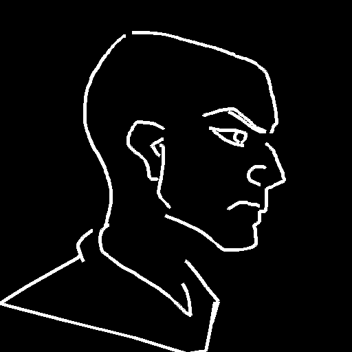
        </td>
        <td style="text-align: center;">
          <strong>Canny</strong> 
          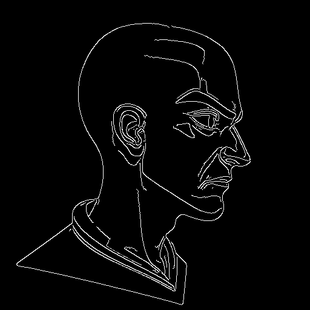
        </td>
      </tr>
    </tbody>
  </table>
  

    Although the InstructPix2Pix pipeline supports an ImageGuidance factor to control adherence to the input image, it tends to follow the drawing too strictly at higher values while losing compositional nuances at lower values.
  

<h1>TODOs</h1>

  
<strong>DATA</strong>

  <ul>
    <li>[ ] Increase amount of hand-drawn line inputs</li>
    <li>[X] Smaller-Bigger subject variations</li>
    <li>[ ] Background Variations</li>
    <li>[ ] Increase Flat style references</li>
    <li>[ ] Improve color matches in prompts</li>
    <li>[ ] Clean up</li>
  </ul>

  
<strong>Training</strong>

  <ul>
    <li>[X] Release V1</li>
    <li>[ ] Release DoodleCharacters (DoodlePix but for characters)</li>
    <li>[X] Release Training code</li>
    <li>[X] Release Lora Training code</li>
  </ul>

<h2>Credits</h2>
<ul>
  <li>This is a custom implementation of the <a href="https://github.com/huggingface/diffusers/blob/main/examples/instruct_pix2pix/train_instruct_pix2pix.py">Training</a> and <a href="https://github.com/huggingface/diffusers/blob/main/src/diffusers/pipelines/stable_diffusion/pipeline_stable_diffusion_instruct_pix2pix.py">Pipeline</a> scripts from the <a href="https://github.com/huggingface/diffusers">Diffusers repo</a></li>
  <li>Dataset was generated using Chat based DALLE-3, <a href="https://huggingface.co/stabilityai/stable-diffusion-xl-base-1.0">SDXL</a>, <a href="https://huggingface.co/black-forest-labs/FLUX.1-Redux-dev">FLUX-REDUX-DEV</a></li>
  <li>Edge extraction was made easy thanks to <a href="https://github.com/Fannovel16/comfyui_controlnet_aux">Fannovel16's ComfyUI Controlnet Aux</a></li>
  <li><a href="https://www.comfy.org/">ComfyUI</a> was a big part of the Data Development process</li>
  <li>Around 30% of the images were captioned using <a href="https://huggingface.co/vikhyatk/moondream2">Moondream2</a></li>
  <li>Dataset Handlers were built using <a href="https://doc.qt.io/qtforpython-6/index.html">PyQT</a></li>
  <li>Huge Thanks to the OpenSource community for hosting and sharing so much cool stuff</li>
</ul>

