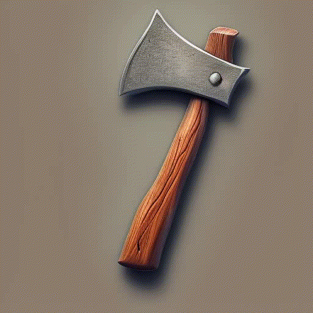
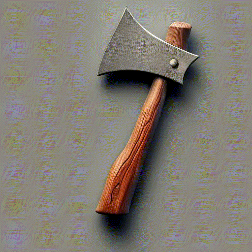
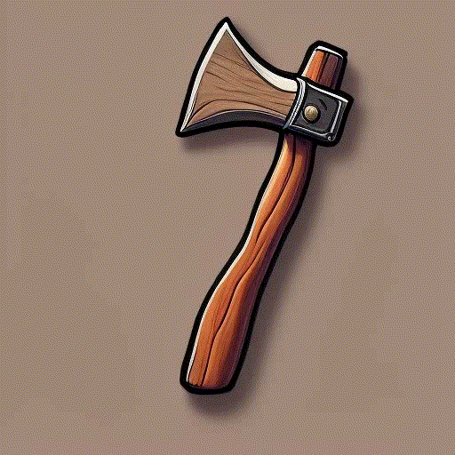
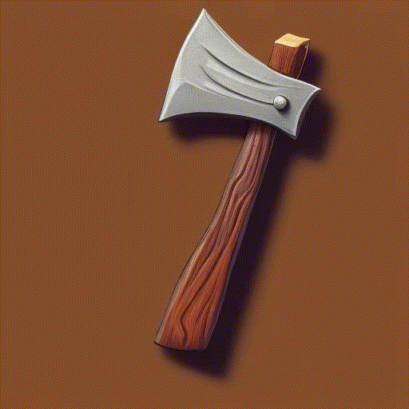

# DoodlePix
Diffusion based Drawing Assistant

This repo is a custom implementation of the InstructPix2Pix model, a text-to-image generation model that uses a text encoder to generate images from text prompts and input images.
in this case the input image is a doodle and the text prompt has this shape example:

<table>
  <tr>
    <td></td>
    <td></td>
    <td></td>
    <td></td>
    <td></td>
  </tr>
  <tr>
    <td></td>
    <td></td>
    <td></td>
    <td></td>
  </tr>
</table>

ALMMOST THERE WITH THE DATA

copy paste input edges (1) inside the Edited image folder, 
compare them briefly, use Data manager to remove or improve input edges

NEED more low values fidelity, more quick bad drawings

add black f0 values images( might be a cool idea)

Training results:
- FidelityMLP still to be implemented in the actual pipeline (was giving issues like size 78 exceeds token limits of ClipTextEncoder which is 77)
- Training with txtEncoder requiring grad kept giving errors so we split the training into two parts:
    - PreTrained txtEncoder in FP32 then load it into unet FP16 training.
- Tried training in BF16 but noticed quite some worsening in the results

Feels data needs more fidelity variation. (seemed like the image guidance was sort of working ranging from 0.5 to 5.0)- maybe FidelityMLP is not needed?

training seems to give good results in alrady 2k steps, but its a fluke, add real VALIDATION drawings, not just canny images.

learning rate should be 5e-5 dont change it.

DELETE SHITTY IMAGES, or too repetive ones.
Check "image_XXXXX, there´s a lot of repetitive ones that could be deleted or at least prompts should be matching.

TODOs

_bis for Hue and Contrast and Vibrant changes
_tris for rotatation and scale crop changes

Data

- [x] change hue of images (white bg and call them bis to correctly learn color changes of same subject)
- [x] HEX Colors NEW (dalleNew - A_outline - A_flat - edited_image - A_3D - A_painted )
- [x] Canny with various fidelity values
- [x] sort Canny after renaming (add <f=x> in front of the name. when copying the images we remove the f=x and we save it as individual txt file in another folder)
- [X] Add Doodles and change fidelity
- [X] Join Prompts
- [X] add [Shading] to Prompts
- [ ] Check all _bis

- [ ] check all normal folders for painted items, delete them all using the DataManager app
- [ ] separate normal and painted [Shading]
- [ ] resize images an save them as tris (use the ImageProcessor App)

- [ ] Halo? High low Contrast, Vibrant, Tags?
- [ ] Token Analysis
- [ ] Plot Colors in data, visualize most common tags, 
- [ ] f = fidelity, (0-9) HED f = 9, Canny f = 10, Scribble f = 3, Other Scribble f = 7
- [ ] p = shading, (flat, painted, 3D, outline)
- [ ] remove <tags:> from prompts ?

f=5, p=flat, bench, #f9c473, #cb6240, #fdfcf8, #ffffff background, <tags: gold, shield, diamond, currency, emblem>

- [ ] Dataset to train general use IpAdapter: controlnet canny + style with Flux Redux at low intensity

--REPORTS

Colors dont follow the prompt, they are random, and change a ton from seed to seed.
--Training with txtEncoder requiring grad kept giving errors
--tried training in BF16 but noticed quite some worsening in the results
--PreTrained txtEncoder in FP32 then load it into unet FP16 training.
