### DoodlePix  
*Diffusion based Drawing Assistant*

  
<strong>The Pipe</strong>

  
  - **Base Model:** StableDiffusion 2.1  
  - **Inference:** fits in < 4GB  
  - **Speed:** ~15 steps/second  
  - **Training Requirements:** < 14GB
  - **Pipeline:** InstructPix2Pix (+ custom fidelity input)

  
<strong>The Data</strong>

  - **Data Size:** ~4.5k images (for now)  
  - **Image Generation:** Dalle-3 and Flux-Redux  
  - **Edge Extraction:** Canny, Fake Scribble, Scribble Xdog, HED soft edge  
  - **Doodles** were hand-drawn and compose about 10% of the edges (for now)

    

  
<strong>Why?</strong>

  
  

    The objective is to train a model able to take drawings as inputs.
  

  
  

    While most models and controlnets were trained using canny or similar line extractors as inputs(which focus on the most prominent lines in an image),
  drawings are made with intention. A few squiggly lines placed in the right place can deliver a much better idea of what's being represented in the image:
  

  
  <table style="width: 60%; table-layout: fixed;">
    <tr>
      <td style="text-align: center;">
        <strong>Drawing</strong> 
        
      </td>
      <td style="text-align: center;">
        <strong>Canny</strong> 
        
      </td>
    </tr>
  </table>
  
  

    To address this, I train a *Fidelity embedding* that injects an explicit fidelity signal into the Unet, allowing it to modulate its denoising behavior accordingly.
  

  
  

    The FidelityMLP (ranging from 0 to 9; f0–f9) lets users decide how much the model should "correct" their drawing. 
 
 
 
 
  Although the InstructPix2Pix pipeline supports an ImageGuidance factor to control adherence to the input image, it tends to follow the drawing too strictly at higher values while losing compositional nuances at lower values.
 
 
  
  

## Fidelity Embedding in Action

*Fidelity values range from 0 to 9 while keeping prompt, seed, and steps constant.*

<table style="width:100%; table-layout: fixed;">
  <tr>
    <td colspan="5" style="text-align:center; font-weight:bold; font-size:0.9rem; padding-bottom:8px;">
      Prompt: f*, axe, metal, wooden handle. grey, brown wood
    </td>
  </tr>
  <tr>
    <td style="text-align:center;">
      <strong>Image</strong> 
      
    </td>
    <td style="text-align:center;">
      <strong>Normal</strong> 
      
    </td>
    <td style="text-align:center;">
      <strong>3D</strong> 
      
    </td>
    <td style="text-align:center;">
      <strong>Outline</strong> 
      
    </td>
    <td style="text-align:center;">
      <strong>Flat</strong> 
      
    </td>
  </tr>
</table>

<table style="width:100%; table-layout: fixed;">
  <tr>
    <td colspan="5" style="text-align:center; font-weight:bold; font-size:0.9rem; padding-bottom:8px;">
      Prompt: f*, red heart, white background.
    </td>
  </tr>
  <tr>
    <td style="text-align:center;">
      <strong>Image</strong> 
      
    </td>
    <td style="text-align:center;">
      <strong>Normal</strong> 
      
    </td>
    <td style="text-align:center;">
      <strong>3D</strong> 
      
    </td>
    <td style="text-align:center;">
      <strong>Outline</strong> 
      
    </td>
    <td style="text-align:center;">
      <strong>Flat</strong> 
      
    </td>
  </tr>
</table>

<table style="width:100%; table-layout: fixed;">
  <tr>
    <td colspan="5" style="text-align:center; font-weight:bold; font-size:0.9rem; padding-bottom:8px;">
      Prompt: f*, woman, portrait, frame. black hair, pink, black background.
    </td>
  </tr>
  <tr>
    <td style="text-align:center;">
      <strong>Image</strong> 
      
    </td>
    <td style="text-align:center;">
      <strong>Normal</strong> 
      
    </td>
    <td style="text-align:center;">
      <strong>3D</strong> 
      
    </td>
    <td style="text-align:center;">
      <strong>Outline</strong> 
      
    </td>
    <td style="text-align:center;">
      <strong>Flat</strong> 
      
    </td>
  </tr>
</table>

More Examples

<table style="width:100%; table-layout: fixed;">
  <tr>
    <td colspan="2" style="text-align:center; font-weight:bold; font-size:0.9rem; padding-bottom:8px;">
      Prompt: f*, potion, bottle, cork. blue, brown, black background.
    </td>
    <td colspan="2" style="text-align:center; font-weight:bold; font-size:0.9rem; padding-bottom:8px;">
      Prompt: f*, maul, hammer. gray, brown, white background.
    </td>
    <td colspan="2" style="text-align:center; font-weight:bold; font-size:0.9rem; padding-bottom:8px;">
      Prompt: f*, torch, flame. red, brown, black background.
    </td>
  </tr>
  <tr>
    <td style="text-align:center;">
      
    </td>
    <td style="text-align:center;">
      
    </td>
    <td style="text-align:center;">
      
    </td>
    <td style="text-align:center;">
      
    </td>
    <td style="text-align:center;">
      
    </td>
    <td style="text-align:center;">
      
    </td>
  </tr>
</table>

The model shows great color understanding as a byproduct of the InstructPix2Pix architecture.

<table style="width:100%; height: 124px; table-layout: fixed;">
  <tr>
    <td colspan="8" style="text-align:center; font-weight:bold; font-size:0.9rem; padding-bottom:8px;">
      Prompt: f9, flower, stylized. *color, green, white
    </td>
  </tr>
  <tr>
    <td style="text-align:center;">
      <strong>input</strong> 
      
    </td>
    <td style="text-align:center;">
      <strong>red</strong> 
      
    </td>
    <td style="text-align:center;">
      <strong>blue</strong> 
      
    </td>
    <td style="text-align:center;">
      <strong>purple</strong> 
      
    </td>
    <td style="text-align:center;">
      <strong>green</strong> 
      
    </td>
    <td style="text-align:center;">
      <strong>cyan</strong> 
      
    </td>
    <td style="text-align:center;">
      <strong>yellow</strong> 
      
    </td>
    <td style="text-align:center;">
      <strong>orange</strong> 
      
    </td>
  </tr>
</table>

The model generates acceptable results with as little as 4 steps.

<table style="width:100%; table-layout: fixed;">
  <tr>
    <td colspan="8" style="text-align:center; font-weight:bold; font-size:0.9rem; padding-bottom:8px;">
      Prompt: f4, alien, red skin, white shirt, white background.
    </td>
  </tr>
  <tr>
    <td style="text-align:center;">
      <strong>Drawing</strong> 
      
    </td>
    <td style="text-align:center;">
      <strong>4 </strong> 
      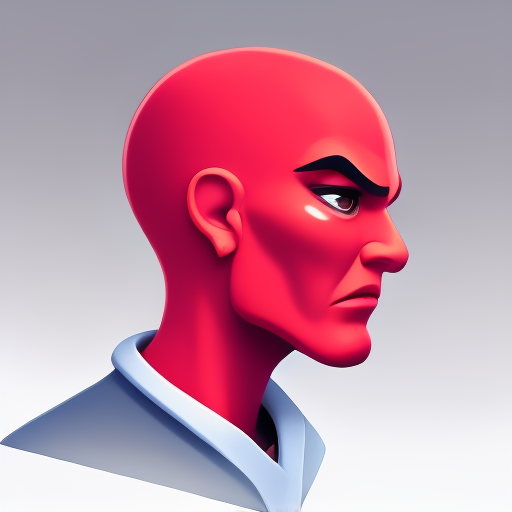
    </td>
    <td style="text-align:center;">
      <strong>8 </strong> 
      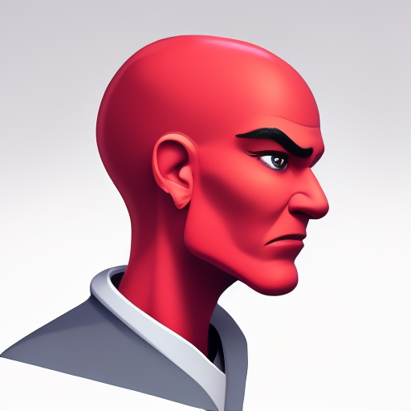
    </td>
    <td style="text-align:center;">
      <strong>14</strong> 
      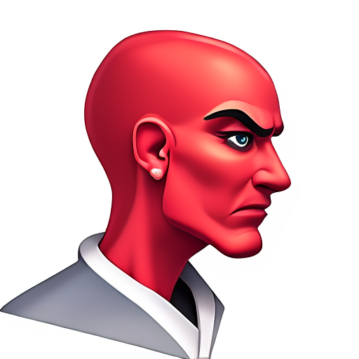
    </td>
    <td style="text-align:center;">
      <strong>20</strong> 
      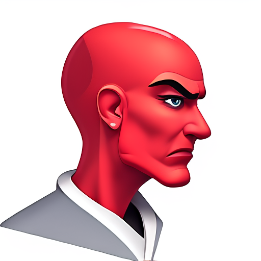
    </td>
    <td style="text-align:center;">
      <strong>32</strong> 
      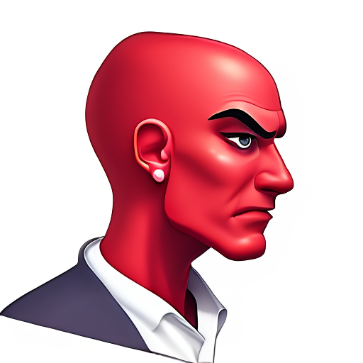
    </td>
    <td style="text-align:center;">
      <strong>44</strong> 
      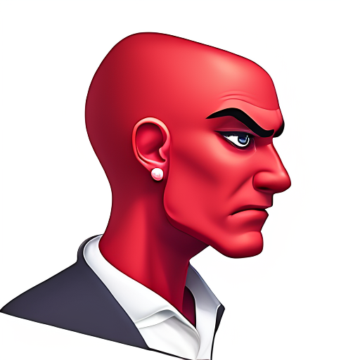
    </td>
    <td style="text-align:center;">
      <strong>60</strong> 
      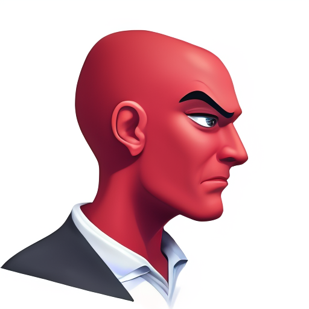
    </td>
  </tr>
</table>

<table style="width:100%; table-layout: fixed;">
  <tr>
    <td colspan="8" style="text-align:center; font-weight:bold; font-size:0.9rem; padding-bottom:8px;">
      Prompt: f4, alien, red skin, white shirt, white background.
    </td>
  </tr>
  <tr>
    <td style="text-align:center;">
      <strong>Canny</strong> 
      
    </td>
    <td style="text-align:center;">
      <strong>4 </strong> 
      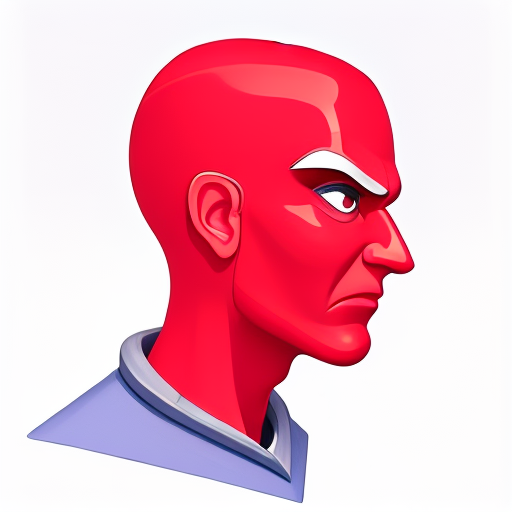
    </td>
    <td style="text-align:center;">
      <strong>8 </strong> 
      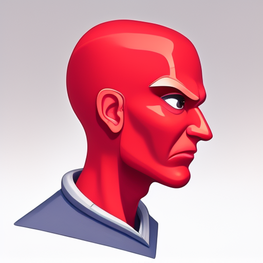
    </td>
    <td style="text-align:center;">
      <strong>14</strong> 
      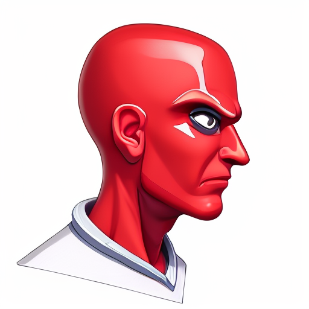
    </td>
    <td style="text-align:center;">
      <strong>20</strong> 
      
    </td>
    <td style="text-align:center;">
      <strong>32</strong> 
      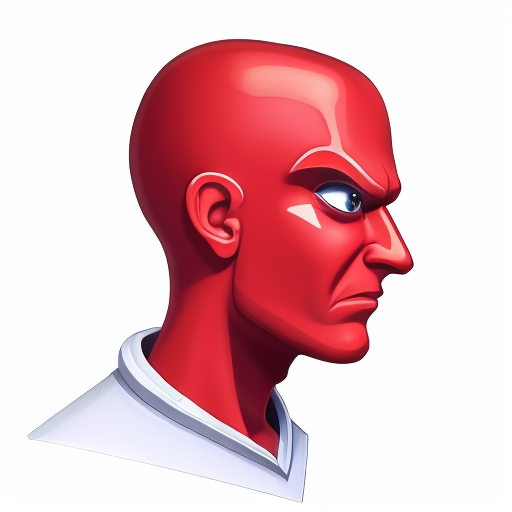
    </td>
    <td style="text-align:center;">
      <strong>44</strong> 
      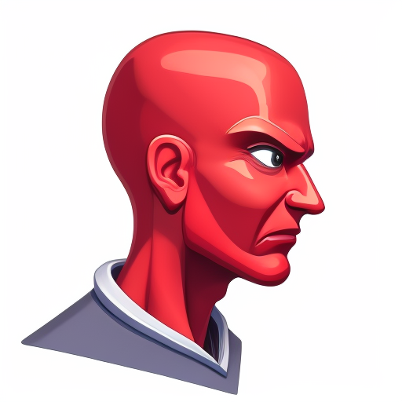
    </td>
    <td style="text-align:center;">
      <strong>60</strong> 
      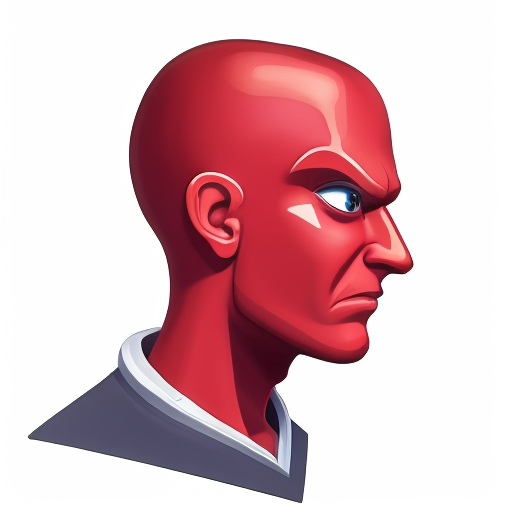
    </td>
  </tr>
</table>

  
<strong>Limitations</strong>

  
  - The **Model** was trained mainly on objects, items. Things rather than Characters.
  - Swords and Blades are a work in progress (lack of Doodle inputs).
  - Flat style wasn't properly learned due to lack of data.
  - Fidelity 0 (f0) is actually high fidelity due to lack of data.
  - It inherits most of the limitations of the StableDiffusion 2.1 model.
  - Training was done at minimum batch size and resolution cause of GPU limitations.
    

# TODOs

  
<strong>DATA</strong>

  
- [ ] Increase hand-drawn line inputs
- [ ] Smaller-Bigger subject variations
- [ ] Background Variations
- [ ] Increase Flat style representation
- [ ] Improve colors matches in prompts
- [ ] Clean up
- [ ] Release Data opensource

  
<strong>Training</strong>

  
- [ ] Train full-precision with bigger batch size.
- [ ] Implement "Details" injection.
- [ ] Release V1.
- [ ] Release DoodleCharacters (DoodlePix but for characters)
- [ ] Release Lora Training code
- [ ] Test Bigger Models
      

